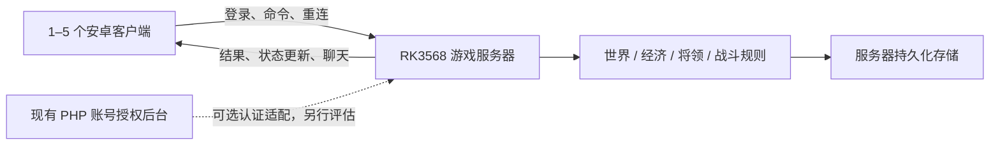

# 模块与功能划分：安卓客户端 + RK3568 五人联机

更新日期：2026-09-29。源码基线：`50b0b0b`。

本文是后续分工和实施方案，**划分不表示这些模块已经拆出或联机已经实现**。项目现状、已完成修改和运行环境请先看[项目接手说明](project-handoff.md)。

## 1. 目标与当前差距

用户确认的第一阶段目标：

| 项目 | 目标 |
| --- | --- |
| 客户端 | Unity 安卓应用，直接在手机上运行；先交付可安装 APK |
| 服务器 | RK3568，暂定 Debian 10、4GB 内存、64GB 存储 |
| 网络 | 先支持同一局域网；外网部署不作为首版前置条件 |
| 人数 | 同一个持久世界最多 5 名真人同时在线，NPC 不计入名额 |
| 玩法 | 玩家拥有独立角色，共享城池、国家、行军和战斗状态 |
| 质量 | 主要流程可重复通过，没有已知的崩溃、丢档、重复结算、严重卡顿和联机状态冲突 |

当前客户端在本地生成世界、运行 AI、计算资源和战斗，并保存整个世界；`admin/` 是 PHP 账号/授权后台。**现在缺少真正的游戏服务器、多人状态同步及安卓/RK3568实机验收**。不能以“登录接口能连上”作为联机完成标准。

首版保留城池、封地、建设、科技、将领、装备、背包、商城、出征、战斗和基础聊天。军团、师徒、结拜等只有入口或未充分验证的功能先逐项评估；未完成入口明确显示不可用，不宣称已支持。

## 2. 部署路线与前置条件

建议采用 **Unity 安卓客户端 + 一个无界面的 C# 游戏服务器 + 一个持久化存储**。服务器内部按模块分工，但先部署成一个进程，避免五人规模下引入多套服务、消息队列和重复世界计算。客户端发送操作意图，服务器校验、计算、保存后返回结果。



暂定技术选择及限制：

- 安卓优先 ARM64/IL2CPP。构建需要 Android Build Support、SDK、NDK、OpenJDK；仓库中的旧安卓配置不代表已能构建。参见 [Unity 安卓环境](https://docs.unity3d.com/6000.3/Documentation/Manual/android-sdksetup.html)、[ARM64 设置](https://docs.unity3d.com/6000.3/Documentation/Manual/class-PlayerSettingsAndroid.html)。
- 新服务器建议 ASP.NET Core / .NET 10 LTS，以 `linux-arm64` 发布。此选择便于提取现有 C# 规则，但 **Unity 的 MonoBehaviour、场景、物理和 UI 不能直接搬进服务器**。共享代码限制在双方支持的 C#/.NET API 范围内，先做编译验证。参见 [.NET 支持周期](https://dotnet.microsoft.com/en-us/platform/support/policy/dotnet-core)、[运行时标识](https://learn.microsoft.com/en-us/dotnet/core/rid-catalog)。
- **Debian 10 是待解决的兼容性项**：其官方 LTS 于 2024-06-30 结束；.NET 10 官方支持列表列出 Debian 12/13、Arm64，没有 Debian 10。优先评估板卡厂商支持的 Debian 12/13 64位镜像；若必须保留 Debian 10，先验证内核、原生依赖和运行时，再确定替代方案，不能假设自包含发布或容器自动解决兼容性。本文不授权刷机。参见 [Debian 公告](https://www.debian.org/News/2024/20240615)、[.NET 10 支持系统](https://github.com/dotnet/core/blob/main/release-notes/10.0/supported-os.md)。
- 游戏数据首版可评估 SQLite，文件放在 RK 本地存储并由服务器访问；WAL 仍只有一个写入者，应配合串行提交，验证持久化同步和备份方式。现有 PHP 账号数据继续使用自己的 MariaDB。最终选择由 M09/M10 在板上验证后确定，不能把 PHP 的 `user.data2` 云字段当成多人世界数据库。参见 [SQLite WAL 的并发与持久性](https://www.sqlite.org/wal.html)。
- 首版只开放必要的局域网游戏入口；数据库和管理入口不直接开放给所有玩家。认证使用 HTTPS，持续同步使用 WSS；证书信任和手机连接配置在 M02/M10 一起验证，不通过关闭证书校验绕过问题。
- RK3568 上不运行 Windows 玩家、Wine、Xvfb 或 noVNC 来充当游戏服务器。现有离屏试玩环境仅用于本机验证。

## 3. 模块清单与职责

下表“现有入口”用于阅读和渐进提取，**不是要求立即移动全部旧文件**。中文脚本名、Unity `.meta` 和序列化字段需保留引用关系。

| 编号 / 模块 | 功能范围 | 现有入口（相对仓库根目录） | 独立交付物与边界 |
| --- | --- | --- | --- |
| **M01 基础模型与协议** | 稳定玩家/实体 ID、世界模型、配置表版本、命令与事件结构、统一时间及错误码 | `web/Assets/Scripts/全局变量.cs`、`玩家数据结构/`、`全局方法类.cs`、`TIME.cs`、各 `全局*库.cs` | 不依赖 Unity 的共享模型；版本化协议；领域模块接口。只有协调窗口改公共协议和总入口，不把旧全局变量继续当联机状态中心 |
| **M02 身份、连接与同步** | 登录、账号到角色绑定、在线人数限制、连接生命周期、初始快照、增量更新、断线重连 | `web/Assets/Scripts/改版脚本/登录脚本.cs`；`admin/API/other.php`、`admin/include/session.php`、登录/心跳/退出模块 | 游戏服务器入口与客户端网络适配；同账号一个有效连接；第 6 名在线玩家明确被拒绝。旧 PHP 可通过认证适配使用，但不执行玩法结算 |
| **M03 世界、国家与封地** | 世界初始化、城池归属、国家加入/建立、封地建立/迁移、建筑建设、科技与生产任务 | `初始化脚本.cs`、`所有城池界面脚本.cs`、`城池信息库类.cs`、`国家信息库类.cs`、`封地界面脚本.cs`、`兵营脚本.cs`、`书院脚本.cs`、`城墙脚本.cs`、`改版脚本/国家科技.cs` | 服务器 World 模块及对应客户端视图适配。费用通过 M05，生产截止时间由服务器控制；城池争夺结算只接受 M06 的有效结果 |
| **M04 将领、部队与装备成长** | 招募、培养、升级、属性、配兵、编队、派遣、装备穿戴/强化/炼魂、俘虏 | `玩家数据结构/将领*.cs`、`编队*.cs`、`招募将领.cs`、`将领功能.cs`、`更换装备脚本.cs`、`强化脚本.cs`、`炼魂脚本.cs` | 服务器 Generals 模块及将领视图。将领只能处于一个合法状态；出征期间禁止重复配兵、出售或派遣。背包消耗委托 M05 |
| **M05 经济、商城与物品** | 金银铜粮、库存、限购、背包、交易、道具效果、费用和奖励账本 | `购买道具脚本.cs`、`使用道具脚本.cs`、`全局商城库.cs`、`全局道具库.cs`、`玩家数据结构/财产信息.cs`、`道具分类列表.cs`、`装备分类列表.cs` | 服务器 Economy 模块；金额、数量、库存和物品归属在服务器验证。一次事务同时完成扣费、发货、限购和记录，其他模块不得自行改余额 |
| **M06 行军、战斗与 AI** | 出征、到达、撤退、山贼、攻守城、伤亡、奖励、AI 行动及战报 | `全局任务脚本.cs` 的军情/AI 部分、`军情信息.cs`、`战场信息.cs`、`战斗系统.cs`、`编队将领移动.cs`、`兵种克制.cs`、`职业加成.cs`、`改版脚本/单将撤退脚本.cs` | 服务器 Combat 模块；纯计算与客户端动画分离。胜负、随机数、伤亡只结算一次；客户端观看速度不改变服务器战果，单个战斗可独立回归 |
| **M07 聊天、通知与战报呈现** | 真人世界/国家/城池聊天、未读提示、系统通知和战报展示 | `聊天系统.cs`、`提示移动.cs`、`军情通知角标.cs`、`改版脚本/Ai军情信息.cs` | 服务器 Chat 模块与聊天客户端。发送者和频道权限来自认证状态，至少两台设备相互收到真人消息；未实现的频道不可伪装成已联机 |
| **M08 安卓界面与客户端表现** | 安卓打包适配、触控、返回键、软键盘、安全区、窗口导航、列表/战斗渲染、帧率和客户端缓存 | `主界面UI脚本.cs`、`界面窗口管理器.cs`、`界面互斥窗口.cs`、`界面点击来源.cs`、两份场景、`Resources/`、`Plugins/`、`ProjectSettings/` | 安卓 ClientShell 与表现层；拥有场景、预制件和项目设置。只显示服务器结果；保留主窗口互斥与子窗口返回，不在关闭界面时结算玩法 |
| **M09 持久化与世界生命周期** | 新世界、恢复、账号角色映射、事务、迁移、备份恢复、幂等记录、服务器重启与计时任务恢复 | `存档脚本.cs`、`存档信息库类.cs`、`加密.cs`；`admin/install/install.sql` 仅参考旧账号结构 | 游戏世界存储与版本迁移；确认成功的命令重启后仍存在。旧六槽本地存档作为单机/导入资料，不允许普通客户端覆盖联机世界 |
| **M10 构建、部署与验收** | 可重复构建、RK3568 服务管理、配置、日志轮转、升级回滚、五机测试、性能与故障回归 | `deploy/preview.ps1`、`local-preview.sh`、`game-preview.sh`；现有验证记录在被忽略的 `audit/` | ARM64 发布/安装/启停脚本、安卓构建脚本、验证用例与证据。运行数据和凭据不提交；只运行本次需要的服务和一个对应试玩实例 |

表内未写前缀的客户端文件均位于 `web/Assets/Scripts/`。领域窗口可维护本领域的 UI 数据绑定脚本，但场景和预制件修改统一交给 M08，避免多个窗口编辑同一份 Unity YAML。

## 4. 建议代码边界与依赖

下面是**待实施目录**，本次仅创建文档，没有生成这些服务器模块：

```text
doc/                                  方案和接手说明
web/Assets/Scripts/                    保留旧脚本，逐项改成适配层
web/Assets/GameModules/
  Shared/                             M01：无 Unity 依赖的模型、协议和纯规则
  Network/                            M02：客户端连接、重连、状态缓存
  World/                              M03：世界客户端绑定
  Generals/                           M04：将领客户端绑定
  Economy/                            M05：经济客户端绑定
  Combat/                             M06：战斗客户端绑定
  Chat/                               M07：联机聊天与通知
  ClientShell/                        M08：界面导航和安卓表现
shared/Dwsg.Shared.csproj              M01：编译引用 Shared 的同一份源码
server/
  Host/                               M02：传输与认证入口
  Runtime/                            M01：世界调度和命令提交总入口
  Modules/
    World/                            M03
    Generals/                         M04
    Economy/                          M05
    Combat/                           M06
    Chat/                             M07
  Persistence/                        M09：数据库、事务和迁移
deploy/                               M10：构建与设备部署脚本
```

`Shared/` 通过 Unity 程序集定义禁止引擎引用，服务器通过共享项目引用同一份源码；不能分别复制一份规则后各自修改。具体目标框架和程序集引用在 M01 的双端编译试验后锁定。

依赖顺序：M01 → M02/M09 → M03/M04/M05 → M06。M07 依赖 M02 的认证、事件通道。M08 与领域模块通过状态和命令接口对接。M10 从平台验证开始贯穿全程。

### 必须先统一的跨模块约定

以下是设计约定，不是已有 API：

| 约定 | 要求 |
| --- | --- |
| 身份 | `accountId`、`playerId`、`worldId` 分开；实体使用稳定 ID，禁止把列表下标、显示名字或浮点值当跨设备身份 |
| 命令 | 至少包含 `protocolVersion`、`requestId`、`worldId`、命令类型与参数；操作者由服务器会话取得，客户端不能指定任意玩家替自己执行 |
| 请求去重 | 重试沿用相同 `requestId`；以世界、玩家、请求 ID 去重。请求结果、数据修改、去重记录一并持久化，重启后重发也不能重复扣费/奖励 |
| 状态同步 | 初始快照 + 有序增量；序列按接收流定义。过期版本、序列缺口或断线后重新获取授权快照，不把旧缓存反写给服务器 |
| 数据可见性 | 公共地图与私人背包/账号数据分别授权；不能给每个客户端发送整个 `所有玩家数据表` |
| 模块调用 | 接收命令、认证上下文、受控世界上下文；返回结果及变更集。世界总入口统一校验、提交、持久化和广播，各模块不自行开连接或写别人的数据 |
| 并发 | 同一世界的修改先按顺序处理；跨经济、将领、城池和战斗的操作一次提交。不能依赖客户端按钮禁止连点来防重复交易 |
| 时间 | 资源、建造、行军和战斗使用服务器时间；区分运行中的单调计时与可恢复的 UTC 截止时间，明确停服期间的推进/暂停规则 |
| 错误 | 统一“未登录、权限不足、余额不足、状态冲突、版本不兼容、人数已满”等错误码；失败不得留下部分扣费或半完成状态 |
| 配置与随机性 | 版本化游戏表；服务器掌握战斗随机源。客户端不上报最终胜负，动画倍速不改变实际结算 |

跨模块实例：`出征` 由 M06 协调，调用 M04 验证并占用部队、调用 M05 扣除所需资源，M01/M09 原子提交；失败全部撤销。到达和结算再次验证战斗 ID/版本后，更新 M03 城池、M04 兵力和 M05 奖励，最后通过 M02/M07 下发状态与战报。

## 5. 多窗口协作方式

### 文件所有权

| 共享/高冲突位置 | 唯一修改负责人 | 其他窗口的提交方式 |
| --- | --- | --- |
| 协议、共享基础类型、`全局变量.cs`、`全局方法类.cs`、新世界 Runtime | M01 / 集成窗口 | 提出所需字段、命令及变更；由负责人统一修改 |
| `初始化脚本.cs`、`全局任务脚本.cs`、旧 `玩家数据.cs` | M01 / 集成窗口负责拆分接线 | M03–M06 在各自新模块实现，提交明确的旧入口替换点；不同时整文件重构 |
| 两份 `.unity` 场景、共用预制件、字体、`Packages/`、`ProjectSettings/` | M08 | 领域窗口提供脚本字段/按钮绑定需求，M08 统一接入 |
| 登录客户端、PHP 认证模块、旧账号数据库变更 | M02 | 通过认证适配接口提出需求；M09 不修改旧账号表 |
| 游戏数据库 schema、迁移、备份和提交事务接口 | M09 | 提供实体和持久化需求，禁止各模块分别创建数据库 |
| 构建/部署脚本、端口与服务配置模板 | M10 | 提供模块健康检查、依赖和启停要求 |

推荐最多先用四个工作窗口，外加一个集成/验收窗口：

| 窗口 | 模块组合 | 第一项可独立任务 |
| --- | --- | --- |
| 集成窗口 | M01，统一合并与验收 | 确定身份、协议、纯共享模型和文件所有权，建立两端编译入口 |
| 服务基础窗口 | M02 + M09 | 五人连接限制、角色绑定、持久化快照与重连；先用最小世界联调 |
| 经营玩法窗口 | M03 + M04 + M05 | 先完成购买道具的服务器事务，再迁移建筑与将领命令 |
| 战争窗口 | M06 | 提取可无界面运行的山贼战斗计算，随后接行军和城池战斗 |
| 客户端交付窗口 | M07 + M08 + M10 | 先验证 ARM64 APK；同时核实 RK 平台，接入网络状态和统一导航 |

人数较多时可再按 M03/M04/M05、M08/M10 分开；每个模块仍只有一个修改负责人。接口未冻结前，客户端/战斗窗口可以做无网络的接口适配或纯规则测试，不能自行另造一套协议。

### 每个窗口的开始与交付规则

1. 先读 `AGENTS.md`、[接手说明](project-handoff.md) 和本文，检查 `git status`；以集成窗口指定的同一提交为起点。
2. 每个窗口使用独立分支和工作副本。已有合适的工作副本可以复用；不得让多个窗口在同一工作目录切分支、提交或争抢 Unity 缓存。
3. 任务描述至少写明：模块编号、允许修改路径、输入/输出约定、依赖提交、验收用例、禁止修改的共享文件。先领取文件所有权再动手。
4. 每次完成必要验证后做本地 Git 提交。没有明确要求时不推送 GitHub；不要频繁生成过程 Markdown。测试代码若具有长期回归价值可以提交，测试账号、数据、结果和临时探针放在被忽略的位置。
5. 交付时报告提交哈希、改动摘要、验证结果、未解决问题和需要集成窗口接入的点；不跨窗口重构别人的模块。
6. 集成窗口审查变更、按依赖顺序合并、跑跨模块回归，再在用户要求上传时统一推送。不要用强制推送覆盖其他窗口的历史。
7. 只启动任务所需的服务/客户端，记录实例归属；替换构建前关闭旧实例，验证结束清理临时实例。未经新运行指令，保持当前已关闭的试玩环境停止。

可直接复制的窗口任务模板：

```text
负责模块：Mxx（模块名称）
起点：集成窗口指定的提交
允许修改：本模块的新目录和明确分配的旧适配脚本
接口：使用 M01 统一协议、身份、时间和事务约定
首项交付：一个明确、可运行和可验证的流程
验收：正常路径 + 越权/重复/并发/重连等相关失败路径
限制：不改他人模块、公共场景或全局总入口；不提交运行数据和凭据
提交：验证后本地提交，报告哈希；除非用户明确要求，不推送远端
```

## 6. 实施阶段与退出条件

| 阶段 | 重点 | 进入下一阶段前必须达到 |
| --- | --- | --- |
| **P0 平台与契约** | RK 系统/Arm64/运行时验证，Unity 版本及旧插件审查，共享模型与协议 | RK 上最小服务可以启停；ARM64 APK 可安装、启动和触控；公共类型在两端编译。Debian 10 路线的问题有明确处理结论 |
| **P1 最小联机闭环** | M01/M02/M05/M09，角色、地图快照、购买道具 | 两个安卓客户端看到同一世界、不同角色；购买由服务器扣费并持久化；断线重连不重复执行；第 6 个连接被正确拒绝 |
| **P2 经营与成长** | 建国/封地/建设/科技/将领/装备及道具 | 多人并发不会负余额、重复领将、丢物或重复占用将领；所有倒计时采用服务器规则，重启可恢复 |
| **P3 行军与战斗** | 山贼、AI、攻守城、玩家之间的争夺、基础聊天 | 两台设备看到一致军情与结果；相同城池争夺有唯一合法结算；查看/退出战斗和客户端倍速不改变战果 |
| **P4 五机稳定试玩** | 实机回归、长期运行、故障恢复、部署升级 | 完成下列发布门槛，无未解决的阻断问题；提供可重复安装、启停、备份和恢复步骤 |

## 7. “五人可玩、没有明显 BUG”的发布门槛

以下是**计划验收标准，尚未通过**。Android 机型/最低系统版本需在 P0 选定并记录，不能用 Windows/Wine 帧率代替。

| 验收面 | 必须通过的场景 |
| --- | --- |
| 安装与启动 | APK 在选定 ARM64 安卓机上安装、冷启动、重启进入；更新保留同一账号身份；无缺失字体、插件或触控失效 |
| 身份与上限 | 5 个独立账号/角色同时在线；第 6 名被明确拒绝；同账号新连接接管后旧连接失效，重连不新建角色或重复占用名额 |
| 世界一致性 | 城池归属、国家、行军到达和战果一致；按权限展示私人数据；客户端修改本地余额或时间不能影响权威数据 |
| 交易与成长 | 边界余额、库存、背包容量、连点、重试、并发购买/升级/配兵均无重复扣款、重复奖励、负数或物品丢失 |
| 冲突与战斗 | 同城池同时出征、战斗中撤退、重复结果、玩家断线、AI 插入行动均按规则处理；奖励和伤亡只结算一次 |
| 重连与恢复 | Wi-Fi 中断后恢复、应用切后台/被系统杀死、服务器重启后恢复；已确认命令不丢失，未确认命令可安全查询/重试；迁移失败可回滚并从备份恢复 |
| 界面 | 主窗口连续切换、子窗口多层返回、城池开关、地图/封地/战斗切换和安卓返回键；至少 100 轮切换不积累可见旧窗口或持续增长的监听/对象 |
| 聊天 | 5 人发送可接收；频道权限、长度限制、发送频率和断线处理有效；未完成频道有明确说明 |
| 稳定性 | 5 台安卓设备连接 RK3568 至少连续 2 小时，覆盖经营和战斗；无崩溃、卡死、丢档、状态分叉及持续增长的内存 |
| 性能 | 初始目标：目标手机主地图/普通界面稳定 30 FPS，界面本地反馈 p95 ≤150ms，健康局域网普通命令确认 p95 ≤300ms；记录场景和统计方法，超标先分析再调整 |
| 板端资源 | 初始预算：游戏服务与必需存储总常驻内存 ≤2GB，5 人运行平均 CPU ≤60%、无持续交换和过热降频；监测负载、队列、日志及磁盘增长。这是预算，尚无实测证明 |
| 交付 | 有指定提交对应的 APK 和 ARM64 服务构建、配置模板、升级/回滚/备份步骤；凭据、正式数据和测试结果不进入源码仓库 |

阻断发布的问题包括：P0（数据丢失、严重越权或世界损坏）、P1（主要流程崩溃/卡死、无法五人联机、重复结算等）。影响正常操作的 P2 也须修复或关闭相关入口，不能用“代码里有按钮”代替可玩性证明。其余问题列出复现方法、影响范围和负责人。

**下一步推荐起点：先完成 P0，再由购买道具建立 P1 的服务器权威闭环。** 它同时覆盖身份、协议、经济、持久化、同步和重试，比直接把整个 `全局任务脚本` 改成网络脚本更容易验收。
