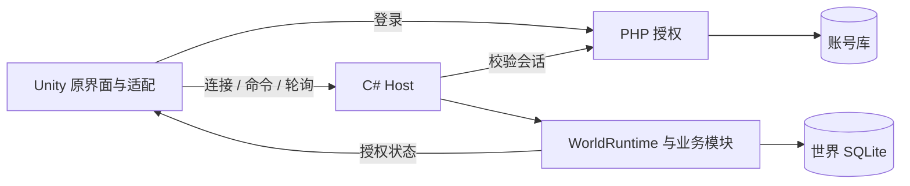

# 模块与功能划分：安卓客户端、RK3568、五人局域网

更新日期：2026-09-30。本文记录当前代码边界和后续分工，替换早期“尚无游戏服务器”的实施草案。现状见[接手说明](project-handoff.md)，证据见[本轮工作记录](2026-09-30-interface-backend-integration.md)。

## 目标与现状

| 项目 | 目标 | 当前状态 |
| --- | --- | --- |
| 客户端 | Unity 安卓应用 | Windows 隔离构建/运行通过；APK、安卓实机待完成 |
| 服务器 | RK3568，暂定 Debian 10、4 GB / 64 GB | C# Host + SQLite 本机可运行；板端 ARM64 与依赖待验证 |
| 网络 | 同一局域网，最多五名真人 | 五个本机实际客户端通过；五台手机待验证 |
| 玩法 | 同一持久世界，独立角色，共享国家、城池、军情 | 主要模块已有命令、授权投影和持久化；不能等同全功能验收 |
| 品质 | 原风格、无明显阻断问题 | 本轮修复已复现问题；不宣称全游戏无 BUG |

当前采用模块化单服务进程。RK 上运行无界面游戏服务，不把 Windows 客户端、Wine 或远程绘图作为板端服务器。

## 模块边界

保留既有 M01—M10 编号，新增领域使用 M11/M12，方便历史任务继续定位。

| 编号 | 职责与代码 | 已有实现 | 后续重点 |
| --- | --- | --- | --- |
| M01 共享规则与提交 | `GameModules/Shared`、`shared/`、`server/Runtime` | 稳定身份、命令结果、串行世界提交与时钟、共享规则 | 协议演进、大世界与长时间调度性能 |
| M02 登录与同步 | `GameModules/Network`、`server/Host`、原登录 | PHP 验证、五人上限、角色绑定、重连、私人投影与请求重试 | 安卓地址/证书、后台与弱网 |
| M03 世界/国家/城池 | `server/Modules/World`、`Administration`，客户端窗口2/3 | 国家基础流程、公告/宣言、任免、城池修筑/征收/竞选/任命/收藏 | 多人长期国战；不重复创建原城池信息页 |
| M04 将领与装备 | `Generals`、`Progress/TrainingModule`、窗口4 | 招募、装备、培养、配兵；修炼和体力恢复接线 | 全等级/全道具与实际手机操作 |
| M05 经济与经营 | `server/Modules/Economy`、`GameModules/Economy` | 商城背包、建设生产、科技、费用奖励和国家经济 | 配置与平衡、长期收益和边界 |
| M06 行军/战斗/AI | `server/Modules/Combat`、`GameModules/Combat`、`Shared/Combat`、窗口3/4 | 山贼、攻守城、资源点、和平驻防、战略 | 五机国战、AI 长测、复杂争夺与表现 |
| M07 聊天与社交 | `Chat`、`Social`、窗口5 | 频道聊天、通知、好友、私聊、黑名单、军团、师徒、结拜 | 深层多角色交互、消息增长、触控与断线 |
| M08 客户端界面/平台 | 原脚本、场景、预制件、资源、ProjectSettings | 原页面、扩展页、导航和服务绑定 | 安卓、插件、触控/键盘/返回键、安全区、逐页视觉性能 |
| M09 持久化 | `server/Persistence`、Host 初始化/备份 | SQLite 世界、角色、回执、重启恢复、备份入口 | 板端恢复、迁移/回滚、磁盘故障与增长 |
| M10 构建与部署 | `deploy/`、Host 配置及平台工具链 | 本机隔离验证已完成多项；尚无完整发布型安装包 | APK、linux-arm64、种子生成、配置、服务管理、五机验收 |
| M11 任务与六部 | `Progress`、窗口1 | 任务/每日/成就、信件/公告、六部职位与任务、计时发奖 | 运营投放、规则完整性、领取边界 |
| M12 称号与赌场 | `Auxiliary`、原称号/赌场脚本 | 原称号装备冷却、下注、轮次、骰子和结算 | 称号获取条件与经济平衡；42称号默认可用不等于官方解锁系统 |

`GameModules` 指 `web/Assets/GameModules/`；客户端和服务端同名领域目录分别存在。`server/Modules/World` 部分源码由现有项目文件纳入编译，不要另建一套重复世界服务。

## 窗口1—5后续分工

这是一份继续协作的边界，不表示自动开启新任务。每轮先指定共同基线与文件所有权。

| 窗口 | 责任 | 可独立修改的范围 |
| --- | --- | --- |
| 监督/集成 | 共享入口、集成、编译、验收、Git | Host 注册/投影、Runtime、公共模型及跨模块入口；查实际界面后才接收成果 |
| 窗口1 | 任务、六部 M11 | 窗口1、Progress；同一规则服务离线与联机 |
| 窗口2 | 国家行政 M03 | 窗口2、Administration 国家规则；共用城池规则与窗口3协调 |
| 窗口3 | 城池、资源点 M03/M06 | 窗口3与资源点独立文件；CombatModule 总入口由监督接线 |
| 窗口4 | 军事与将领入口 M04/M06 | 窗口4、和平驻防、战略；共享军情/战斗脚本先明确唯一负责人 |
| 窗口5 | 社交和附属 M07/M12 | 窗口5、Social、Auxiliary；沿用原称号/赌场界面 |

两份 `.unity` 场景、共用预制件、字体、资源、`Packages/`、`ProjectSettings/` 由一个指定客户端负责人修改，普通接线不必改它们。独立工作副本不争用 Unity 缓存；共享目录协作时仅集成窗口切分支和提交。

## 接入契约

1. 先查原按钮、场景/预制件和脚本。已有功能用适配层接服务端，不另起页面。
2. 服务器决定身份和权限。稳定 ID 与原 UI 下标经适配转换，不下发他人私聊、背包或任务明细。
3. 扣费、状态、奖励与回执在同一 WorldRuntime/SQLite 提交完成。重试复用请求 ID，失败无部分扣费，不另建模块数据库。
4. 行军、任务、冷却、随机结算使用服务器时间。客户端倒计时只显示，不在关闭页面时结算，不用动画倍速决定胜负。
5. 离线/联机明确分流；联机不继续跑重复本地结算，也不把本地存档覆盖多人世界。
6. 异步回执绑定页面代次与目标；换页、关闭重开或换角色后，旧回执不能刷新新页。相同快照不反复重建。
7. 复用原布局、图标、按钮、滚动和文字规范；不拿整图替代功能，不逐个控件盲调坐标。
8. 分别报告规则、SQLite/HTTP、真实按钮、截图、实机的证据。修正过时测试前先证明前提变化，不能删断言凑通过率。

## 目标设备发布门槛

| 验收面 | 必须达到 |
| --- | --- |
| 工具链 | 指定 Unity/依赖可重复构建，ARM64 APK 安装启动，RK 上 Host 与数据库正常启停 |
| 五人连接 | 五设备同一世界、第六人按规则拒绝；接替/重连不丢角色、不多占名额 |
| 交易与战斗 | 重复、并发、越权、背包满、余额边界、撤退和重启不重复扣费/发奖/伤亡 |
| 世界与隐私 | 国家、城池、资源点、驻防和战果一致；私人状态按角色隔离 |
| 界面 | 原风格、×图标、文字对齐，无可见遮挡溢出；连续切换不累积旧窗口；触控键盘可用 |
| 稳定性 | 五安卓连接 RK 连续至少两小时，覆盖经营、战斗、社交及故障；无崩溃、卡死、丢档或持续增长资源占用 |
| 性能 | 在真实设备测帧率、操作延迟、CPU/内存；原目标30 FPS、本地反馈p95≤150ms、局域网普通命令p95≤300ms尚待实测 |
| 交付 | 同提交对应APK与板端包、配置、种子/导入、备份恢复、升级回滚；凭据和正式数据不进仓库 |

下一轮优先实际平台与可重复部署，再做五机长测；同时补深层原界面验收，不重新实施已有模块。

## 提交和运行

必要验证后本地提交，明确授权才推送，保留其他成员历史。最终推送前按需更新 `doc/`；本轮测试程序、数据和产物不提交，已有历史检查源码不擅自删除。

自动操作离屏，只运行必要实例。验证结束清理所属客户端、数据库、Host、Unity 批处理和绘图进程。详细规则以根目录 `AGENTS.md` 为准。
